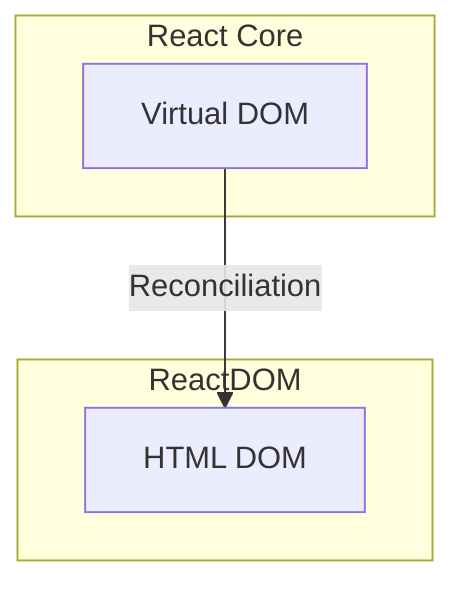
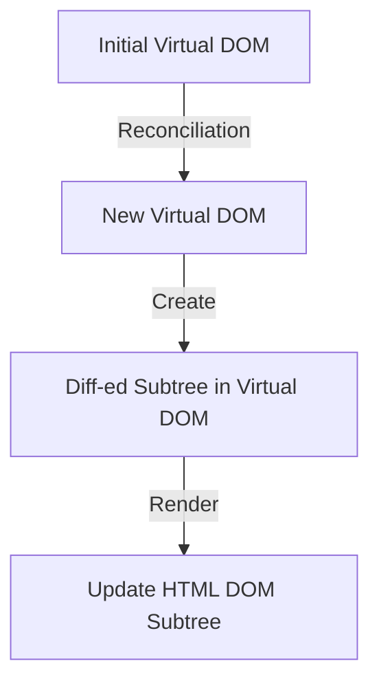
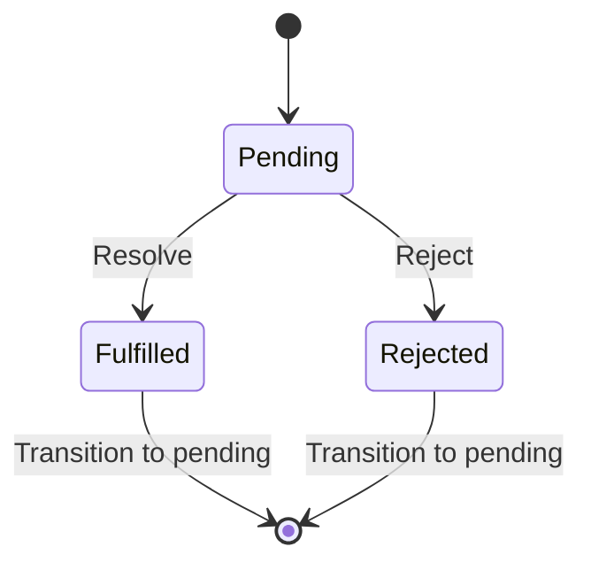
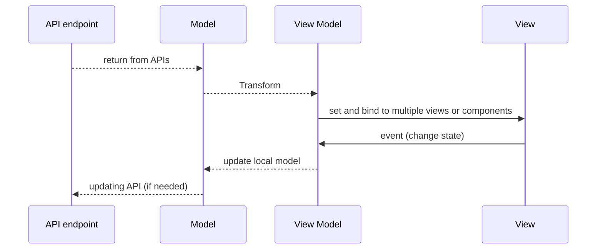

## R𝒶𝓃𝒹ℴ𝓂 REACT 𝒷𝒾𝓉𝓈
```
    |\__/,|   (`\
  _.|o o  |_   ) )
-(((---(((--------  
```
### 00. Use function component
`Function component` was introduced in React 16.8. It is the preferred way to write React component (as opposed to older class component). 
It is more maintainable, modern and concise. Plus you can leverage `React Hooks` which makes it easier to manage states and instead of dealing lifecycle, it uses state (data flow). 
All the new effort is focus in functional ways so `class component` will be slowly deprecated. Note that function component is designed to work well with new `React concurrent mode`. More on that later.

### 01. Bootstrapping with ReactDOM
In React, one of the initial APIs you'll come across is `ReactDOM`, which plays a key role in rendering your application. ReactDOM provides two main methods: render for client-side rendering and hydrate for handling server-side rendered content. These APIs facilitate the initial rendering and the subsequent reconciliation process in your React application.

The render method is used for the initial rendering of your React application on the client side. It establishes the connection between a specific HTML DOM element, designated as the root, and the root node of your React application.

The hydrate method, on the other hand, is employed when dealing with server-side rendered content. It serves to attach event listeners and establish interactivity within the existing HTML structure, thus enabling the hydration of your React application.

Both of these methods are fundamental to the rendering process in React, allowing your application to efficiently bridge the Virtual DOM with the actual HTML DOM.
```javascript
const root = ReactDOM.createRoot(document.getElementById('root'));
root.render( <App /> );
```

Relationship between ReactDOM and Virtual DOM


### 02. Virtual DOM
The `Virtual DOM`, a key concept in React, serves as a lightweight, in-memory mirror of the actual Document Object Model (DOM) and the current state of your user interface. It's represented as JavaScript objects, and React leverages it for performance optimization.

React employs the Virtual DOM to enhance updates by employing a process called `reconciliation`. It calculates the disparities between the new Virtual DOM tree and the one generated during the previous render. 

This approach is designed to be efficient. It targets and applies changes only to the portions of the Virtual DOM tree that differ from the previous version, minimizing interactions with the real HTML DOM. This is essential for improving performance since direct manipulation of the HTML DOM can be sluggish, resource-intensive & triggers a whole set of work like layout, property inheritance etc. Prior to 2016, React is using `Stack reconciliation`, after that, react uses `fiber reconciliation`. More on that later.



### 03. JSX
JSX is a convenient syntax for defining the structure and content of your React components. It's transpiled (at build time) into JavaScript code that creates React elements, which are then rendered into the HTML DOM to display your user interface.

Here's a simple transformation from `JSX` to `HTML`:
- `const element = <h2>Hello, Lenny!</h2>;  // JSX` to
- `const element = React.createElement("h2", null, "Hello, Lenny!");  // Javascript` to
- `ReactDOM.render(element, document.getElementById("root"));   // React render` to
- `<body id='root'><h2>Hello, Lenny!</h2></body>` (HTML tree)

In this example, it may not seem like JSX provides a significant advantage. In practical scenarios, you can create self-contained logical components, like a "Wallet," with their own HTML structure and behavior, which can be easily reused throughout your application. 

In standard HTML, this level of encapsulation isn't readily achievable. To attain such encapsulation, you would need to utilize `shadow DOM`, a relatively recent addition in HTML standard. While conceptually similar to JSX, there's a notable distinction: shadow DOM operates directly on the real DOM, whereas JSX serves as a logical construct that interfaces with the Virtual DOM, residing in JavaScript memory.

### 04. React tools
These are some must have tools for React.

- [Glean for JSX refactoring](https://marketplace.visualstudio.com/items?itemName=wix.glean)
- [React Dev Tools](https://chrome.google.com/webstore/detail/react-developer-tools/fmkadmapgofadopljbjfkapdkoienihi)
- [Prettier](https://prettier.io/)
- [VS Code](https://code.visualstudio.com/)
- [Eslint](https://eslint.org/)
- [Github CoPilot](https://marketplace.visualstudio.com/items?itemName=GitHub.copilot)

### 05. Show Update Highlights
One of the tool that we use to show render update is in React Dev Tools. To enable this feature:

- Go into Chrome dev tools (Cmd, Option+i) and go to Components tab.
- Next to the search box, click on the `settings` icon.
- Click on the " Highlight updates when components render" checkbox.

This tool is invaluable to show when your React application does unneccessary rendering which is bad for performance.

### 06. React StrictMode
You may have seen the following code. This code enables `StrictMode` for React development.

```javascript
  <React.StrictMode>
    <App />
  </React.StrictMode>
```

Why do we need StrictMode?

- Warn us about bad practices in React development such as making a network call duing render
- Detecting duplicate render cycles
- Detecting inconsistent update
- Deprecated API usage

StrictMode does double invocation. It helps identify issues like unintentional side effects in the render phase or components that may rely on a specific rendering order. This is only during development.
It's important to understand that this behavior is only seen in the development environment when React Strict Mode is enabled. In a production environment, this double invocation doesn't occur, and your components behave as expected.

### 07. React Router
`React router` handles routing and navigation in React applications. It enables you to create single-page applications (SPAs) with dynamic URLs, allowing you to define different components for different routes without the need for full-page reload. In this code example, `/wallet` will result in the rendering of `<Wallet/>` component. Whenever the `path` doesn't match to any known paths, it will send to the default which is `<NotFound/>` in this example. React router supports HTML5 history API which means 
back and forward are automatically handled.

```javascript
function App() {
  return (
    <Router>
      <div>
        <Switch>
          <Route path="/info"><Info /></Route>
          <Route path="/wallet"><Wallet /></Route>
          <Route><NotFound /></Route>
        </Switch>
      </div>
    </Router>
  );
}
```
```
  / _ \
\_\(_)/_/
 _//o\\_ 
  /   \
```
### 08. Error Boundary
Error boundaries in React are a powerful feature that allows you to gracefully handle and display errors that occur within the component tree.
Think of it like a `try .. catch .. finally` block, if error occurred within the subtree, an error UI will display and do whatever logging to ensure
developer gets notified in development or production.

To use `ErrorBoundary`:
```javascript
<ErrorBoundary>
   <FeatureComponentSubTree />
</ErrorBoundary>
```

It is important for developers to implement their own error boundaries because error handling can be highly application-specific. 
```javascript
export const ErrorBoundary = ({ children }) => {
  const errorEvent = 'Error';
  const [isError, setIsError] = useState(false);

  useEffect(() => {
    const errorHandler = (error) => {
      console.error(error);
      setIsError(true);
    };

    window.addEventListener(errorEvent, errorHandler);

    return () => {
      window.removeEventListener(errorEvent, errorHandler);
    };
  }, []);

  if (isError) {
    return <GenericError/>;
  }
  return children;
}
```

### 09. React Lazy & Code Splitting
`Dynamic import` in JavaScript is a feature introduced in `ES11` that allows you to import modules or code dynamically, at runtime, rather than at the top level of a module. This is especially useful for lazy-loading modules and improving the performance of your web applications by only loading code when it's actually needed, rather than all at once. 

```javascript
import React, { lazy } from 'react';

const lazyObject = lazy(() => import('./LazyComponent'));
```
React leverages the `ES11 dynamic import` feature to implement React lazy loading. In the following example, the 'lazyObject' module is neither compiled nor downloaded during the application's initial load; instead, it is deferred until it's invoked later in runtime, typically when you use `<lazyObject/>`.

This technique synergizes effectively with code splitting, a common practice during React builds with tools like Webpack. With code splitting, all the code associated with 'LazyComponent' is packaged and minified into a separate bundle. Only when you eventually invoke `<lazyObject/>`, it triggers the download, parse and compilation of 'lazyObject' at that point in time, optimizing the application's loading performance.

### 10. Suspense and fallback
`Suspense` and `fallback` are concepts introduced in React to handle asynchronous operations, such as code splitting and data fetching. The `lazyObject` above is one example that we can leverage 
Suspense and fallback:

```javascript
import React, { lazy, Suspense } from 'react';

const lazyObject = lazy(() => import('./LazyComponent'));

function App() {
  return (
    <div>
      <Suspense fallback={<div>Loading...</div>}>
        <lazyObject />
      </Suspense>
    </div>
  );
}
```
In the code above, while lazyObject is not ready, it will show `loading...` until the component is ready for render. 

Suspense work with Promises (Javascript). Promise has 3 states: `pending`, `fulfilled` & `rejected`. It will use fallback component when it is `pending`. It will show the `lazyObject` when it is `fulfilled` and it will show error if there's an Error boundary defined and state is `rejected`. Although this example shows lazy import of component, other use cases like animation loading and data fetching can also use this pattern.

State Machine for a Promise


### 11. React Fragments
Before the introduction of `React Fragments`, when you had multiple sibling components like `<Component1/><Component2/><Component3/>`, React required that you return a single root node from a function component. To work around this limitation, developers often used a `<div>` as a wrapping root element. However, this approach came with downsides such as bloated hierarchy, longer tree construction times, event propagation complexity, and increased property inheritance costs in the HTML DOM.

```javascript
// before
<div>
  <Component1/>
  <Component2/>
  <Component3/>
</div>

// after: with fragment
<>
  <Component1/>
  <Component2/>
  <Component3/>
</>

```
React Fragments provide a solution to this issue. They allow you to group and return multiple adjacent elements without affecting the HTML DOM structure. Essentially, a React Fragment is a lightweight and invisible container that doesn't introduce additional elements to the DOM. This feature ensures cleaner and more efficient code, particularly when rendering lists of components or handling adjacent elements.

### 12. ThemeProvider
`ThemeProvider` allows you to define and manage a theme or set of design variables (e.g., colors, typography, spacing) and make them available to your components throughout your application. It 
also allows theme to be change at runtime (eg. from light theme to dark theme) and all components update in a flash. It is normal to have `ThemeProvider` close to the root of your Application.

```javascript
const theme = {
  colors: {
    primary: 'red',
    secondary: 'pink',
  },
};

const blueTheme = {
  colors: {
    primary: 'blue',
    secondary: 'cyan',
  },
};


const MyButton = styled.button`
  background-color: ${props => props.theme.colors.primary};
  color: ${props => props.theme.colors.secondary};
  padding: 10px 20px;
`;

<ThemeProvider theme={theme}>
  <MyButton /> <!-- can be a subtree of components -->
</ThemeProvider>

// code can call setTheme(blueTheme) and theme will change.
```

### 13. Function & class component mapping
While we know we should be using function component, it is good to know how to map the lifecycle of class component over to function component:

- componentDidMount
```javascript
useEffect(() => {
  // code (runs after the initial render)
}, []);
```
- componentDidUpdate
```javascript
useEffect(() => {
  // code (runs when specified dependencies change)
}, [propA, propB]);
```
- componentWillUnmount
```javascript
useEffect(() => {
  return () => {
    // clean up code  (runs when the component unmounts)
  };
}, []);
```
- shouldComponentUpdate
```javascript
const MyComponent = React.memo(({ prop1, prop2 }) => {
  // Your component logic
});

const memoizedValue = useMemo(() => computeExpensiveValue(prop), [prop]);
```

### 14. React Rendering (SSR or CSR)
In the early web days, everything is rendered on the server and sent down to the browser as HTML format. I call this `pure SSR` and should not be confused with React `SSR`.

React CSR is client side rendering. This is when react bundle is being downloaded (typically from CDN) and being rendered on the client.
- A root empty HTML page is loaded from CDN. This will bring in React bundle andReact takes over the rendering process on the client side.
- Data Fetching: After the initial page is hydrated, you can use JavaScript to fetch data from APIs or other sources. Data fetching can be triggered in response to user interactions, like button clicks or route changes.

React SSR is server side rendering. This should really be `hybrid rendering`. This is the typical case:
- Initial Server-Side Rendering (SSR): When a user first loads the page, the server performs the initial rendering of the React components and sends HTML to the client with the data available at that point. The initial data can be obtained by fetching from an API or other sources on the server before rendering.
- Client-Side React Hydration: After the initial HTML page is loaded in the browser, the JavaScript code for your React application is executed, and the client-side hydration process occurs. React on the client side takes over and recognizes the existing HTML structure, reattaches event handlers, and brings the page to an interactive state.
- Subsequent Data Fetching: Once the initial page is loaded and the React components are hydrated, you can use client-side JavaScript to make subsequent API calls as the user interacts with the application. These subsequent API calls can be triggered by user actions, such as button clicks or route changes.

React SSR normally get you better SEO support, requires servers to be setup. While CSR can be cheaply setup to all point to CDN without any server host.

### 15. useState
`useState` is a fundamental React hook that enables you to incorporate and manage state variables within your functional components. The following example illustrates the basic usage of useState with a primitive data type. You can utilize `count` as an accessor and `setCount` as a mutator.

```javascript
// dealing with primitive type
const [count, setCount] = useState(0);
..
return(<>
<p>Count: {count}</p>
<button onClick={() => setCount(count + 1)}>+</button>
</>);
```
```
            .''
  ._.-.___.' (`\
 //(        ( `'
'/ )\ ).__. ) 
' <' `\ ._/'\
   `   \     \
```
### 16. useState with Javascript object
You can use useState for object as well. Imagine this code. You can reference to the property of object for rendering. However, please note that we need to create a new object whenever we setUser.
When updating state variables that are objects or arrays, it's important to create a new object or array to trigger a re-render. React relies on shallow comparison to determine if state has changed.
This means `name` and `id` is always coupled together in the rendering cycle.

```javascript
const [user, setUser] = useState({ name: 'Lenny', id: 8 });
...
<p>Name: {user.name}</p>
<p>Id: {user.id}</p>

<button onClick={() => setUser({ ...user, id: user.id + 1 })}>+</button>
```

```javascript
let obj = { name: 'Lenny', id: 8 }
const [user, setUser] = useState(obj);
...
<p>Name: {user.name}</p>
<p>Id: {user.id}</p>

// this will not trigger re-render !!!
<button onClick={() => { obj.name = 'Kenny'; setUser(obj) }}>+</button>
```

The above code will never trigger re-render when `button` is clicked. This is because the setUser(obj) is setting the same object reference, thereby no change detected.

The three takeaway is React uses shallow comparison for object, you need to create a new object to trigger change & new object will change for all properties inside it.

### 17. React Batch Update
If you call this code:
```javascript
<button onClick={() => {
 setCount(count + 1);
 setCount(count + 1);
 setCount(count + 1);
}}>+</button>
```
you might not get the expected result because React batches state updates. React is designed to optimize state updates for performance, and it might batch multiple setState calls into a single update. This means `count` is not updated synchronously and after all this event, `count === 1`. If you have to call multiple times, should use the functional update form of setState like:
```javascript
<button onClick={() => {
 setCount((prev) => prev + 1);
 setCount((prev) => prev + 1);
 setCount((prev) => prev + 1);
// count will be 3
}}>+</button>
```

### 18. useState as global state
No. Using `useState` as global state management is bad for performance, code maintenance since it needs to be passed into props every where. Stick to using useState in local component.

For global state, use other state management library.

### 19. useContext
`useContext` is a powerful tool for managing and sharing global or shared state and functionality across components in your application. The sharing of data is define at Provider level and can be used without passing through props. This is designed to be a simple global state management API. Here's the code example:

```javascript
import React, { createContext, useContext, useState } from 'react';

// Step 1: Create a context
const MyContext = createContext();

// Step 2: Create a component that provides the context
function ContextProvider({ children }) {
  const [count, setCount] = useState(0);

  const increment = () => {
    setCount(count + 1);
  };

  return (
    <MyContext.Provider value={{ count, increment }}>
      {children}
    </MyContext.Provider>
  );
}

// Step 3: Create a component that consumes the context
function Counter() {
  const { count, increment } = useContext(MyContext);

  return (
    <div>
      <p>Count: {count}</p>
      <button onClick={increment}>Increment</button>
    </div>
  );
}

// Step 4: Wrap the application with the context provider
function App() {
  return (
    <ContextProvider>
      <Counter />
    </ContextProvider>
  );
}
```

The ContextProvider still exhibits some outstanding issues. Consider a scenario where your application receives diverse data types that necessitate multiple layers of Providers. This can become challenging to handle. However, for straightforward global state management, useContext stands out as the optimal choice.

### 20. Jotai as global state
`Jotai` uses atom-based state offers finer control and can be use as a global state. It has all the benefits of useContext but without stuffing Provider layer in the app. Overall, high level features:

- Isolated State: Each atom represents a distinct unit of state. This isolation means that changes to one atom do not affect other atoms. It's especially useful when dealing with complex state structures or lists of items where you want fine-grained control over individual items.

- Selective Updates: When a change occurs in an atom, only components that explicitly depend on that atom are re-rendered. This fine-grained reactivity ensures that components respond only to the specific state changes they care about, which can significantly improve performance.

### 21. useMemo
The `useMemo` hook in React is used to optimize and memoize the result of expensive computations or calculations. It's helpful in scenarios where you want to prevent the re-computation of values on every render. In this example, the `calculateFactorial` will only run if `number` is never seen before.

```javascript

function Factorial({ number }) {
  const factorial = useMemo(() => calculateFactorial(number), [number]);

  return <div>{`Factorial of ${number} is ${factorial}`}</div>;
}

function calculateFactorial(n) {
  if (n <= 1) return 1;
  return n * calculateFactorial(n - 1);
}
```
Similar to useMemo, `useCallback` is use to memoize functions instead of state.

### 22. More on useEffect
No.13 talk about different use of `useEffect` to mimic React class lifecycle. The thing to take note is `useEffect` should only be used if there's a side-effect with some data state change that you want to synchronize with.

There are two common cases in which you don’t need Effects:

- You don’t need Effects to transform data for rendering. For example, let’s say you want to filter a list before displaying it. You might feel tempted to write an Effect that updates a state variable when the list changes. However, this is inefficient. When you update the state, React will first call your component functions to calculate what should be on the screen. Then React will “commit” these changes to the DOM, updating the screen. Then React will run your Effects. If your Effect also immediately updates the state, this restarts the whole process from scratch! To avoid the unnecessary render passes, transform all the data at the top level of your components. That code will automatically re-run whenever your props or state change.
- You don’t need Effects to handle user events. For example, let’s say you want to send an /api/buy POST request and show a notification when the user buys a product. In the Buy button click event handler, you know exactly what happened. By the time an Effect runs, you don’t know what the user did (for example, which button was clicked). This is why you’ll usually handle user events in the corresponding event handlers.

You do need Effects to synchronize with external systems. For example, you can write an Effect that keeps a jQuery widget synchronized with the React state. You can also fetch data with Effects: for example, you can synchronize the search results with the current search query. Keep in mind that modern frameworks provide more efficient built-in data fetching mechanisms than writing Effects directly in your components. More information with sample [here](https://react.dev/learn/you-might-not-need-an-effect)


### 23. Custom Hook
A custom hook in React is a JavaScript function that starts with the prefix "use" and follows the rules of the Hooks API. Custom hooks allow you to extract and reuse stateful logic in function components, making your code more modular and easier to maintain. To consume this custom hook, just call `const id = useUniqueId()`.


```javascript
import { v4 as uuidv4 } from 'uuid';
import { useState } from 'react';

function useUniqueId() {
  const [id] = useState(() => uuidv4());

  return id;
}

export default useUniqueId;
```
```
           __n__n__
    .------`-\00/-'
   /  ##  ## (oo)
  / \## __   ./
     |//YY \|/
     |||   |||
```
### 24. Passing children to a component
Passing children is straigt-forward, use ReactNode as the type.

```javascript
import React, { ReactNode } from 'react';

interface MyComponentProps {
  children: ReactNode; // ReactNode allows any valid JSX content
}

function MyComponent({ children }: MyComponentProps) {
  return (
    <div>
      <h2>My Component</h2>
      {children}
    </div>
  );
}

function App() {
  return (
    <div>
      <MyComponent>
        <p>This is some content passed as children.</p>
        <button>Click me</button>
      </MyComponent>
    </div>
  );
}
```

### 25. What is useRef
`useRef` is a hook in React that creates a mutable object called a "ref object." It acts as a reference to a HTML DOM element or to a value that persists across renders.

The primary purpose of useRef is to provide mutable data that doesn't cause re-renders when it changes. This makes it useful for managing values that need to be updated without causing a component to re-render. In the code below, useRef is creating a reference & later use it to hold input HTML element to control it.

```javascript
function Component() {
  // Create a ref using the useRef hook
  const inputRef = useRef(null);

  // Function to focus on the input element
  const focusInput = () => {
    inputRef.current.focus();
  };

  return (
    <div>
      <input type="text" ref={inputRef} placeholder="Type here" />
      <button onClick={focusInput}>Focus Input</button>
    </div>
  );
}
```

### 26. What is React.forwardRef
`React.forwardRef` allows a component to create an empty `ref` and pass it down to a child component for child component to set it to a value or HTML DOM element. That empty `ref` in the
parent code can access and control the attached `ref` later.

```javascript
const ChildComponent = React.forwardRef((props, ref) => {
  const inputRef = ref || useRef();

  // No useImperativeHandle needed
  return (
    <input
      ref={inputRef}
      type="text"
      placeholder={props.placeholder}
    />
  );
});

function ParentComponent() {
  const childRef = useRef();

  return (
    <div>
      <ChildComponent ref={childRef} placeholder="Enter text here" />
      <button onClick={() => childRef.current.focus()}>Focus Input</button>
    </div>
  );
}
```

### 27. React Callback
In some scenarios, you may encounter situations where an event or change occurs in a child component, and you need to inform the parent component about it. To address this, React offers a straightforward solution called `React callback`.

React callbacks serve as a clean and structured means of communication between components. They help maintain a clear separation of concerns and create well-defined boundaries between parent and child components. It's a valuable approach for passing information and events up the component hierarchy.

However, it's important to exercise caution when applying this pattern in complex applications with multiple layers. Excessive use of callbacks across many component layers can potentially hinder maintainability and lead to code that's harder to manage. In such cases, it might be worthwhile to explore alternative solutions for state management and component communication.

```javascript
interface ChildProps {
  onCheckboxChanged: (isChecked: boolean) => void;
}

function Child({ onCheckboxChanged }: ChildProps) {
  const [isChecked, setIsChecked] = useState(false);

  const handleCheck = () => {
    const newCheckedState = !isChecked;
    setIsChecked(newCheckedState);

    // callback to parent here.
    onCheckboxChanged(newCheckedState);
  };

  return (
     <input
       type="checkbox"
       checked={isChecked}
       onChange={handleCheck}
     />
  );
}

// Parent
function Parent() {
  // ensure we memoized callback function
  const handleChildCheckboxChanged = useCallback((isChecked: boolean) => {
    console.log('checkbox state:', isChecked);
  }, []);

  return (
    <div>
      <Child onCheckboxChanged={handleChildCheckboxChanged} />
    </div>
  );
```

### 29. React Build process
Ever wonder what happen when you run `npm run build` or `yarn build`. There's a whole lot of tasks being executed:

- Clean build folder
- Linting (eg. eslint static analysis)
- Transpilation
  - typescript to javascript
  - scss / sass to css
  - jsx to javascript (React.createElement)
  - babel to lower end browser
- Treeshaking (removed unused code)
- HTML template expansion
- Asset optimization
  - Image Optimization (eg. PNG to 24 bits, resize, format)
  - Remove styles from CSS
- Minification of Javascript / CSS
- Webpack
  - module bundling for code splitting
  - service worker generation for version caching
- Version bumping to the bundle

```
        _   ,_,   _
       / `'=) (='` \
      /.-.-.\ /.-.-.\ 
      `      "      `
```
### 30. Publishing react component to NPM registry
You have been using `npm install` or `yarn add` to add external library into your project but how do you publish a component. Here's the process:

- Create your component.
```javascript
import React from 'react';

function ButtonComponent({ label, onClick }) {
  return (
    <button onClick={onClick}>
      {label}
    </button>
  );
}

export default ButtonComponent;
```
- Create your package.json
```javascript
{
  "name": "awesome-button-xyz",
  "version": "1.0.0",
  "description": "A must have component",
  "main": "ButtonComponent.js",
  "scripts": {},
  "author": "Lenny Kim",
  "license": "MIT"
}
```
- Go to https://npmjs.com and create a user, then login to it.
- Run `npm publish`
- Next you can pull it with `npm install awesome-button-xyz`.

### 31. Choosing external package / library
Sometimes, you won't have to reinvent the wheel when building a React application. In many cases, you'll search for external packages that can save you time and effort. However, when considering whether to include an external package, it's essential to evaluate various factors for feasibility before making a decision. Here are some key factors to consider:

- Security and Vulnerabilities: Assess the package's security. Check if there are any known vulnerabilities associated with the package. Tools like npm audit can help identify security issues.

- Active Maintenance: Determine if the package is actively maintained. Check if there have been recent additions or updates to the package. An actively maintained package is more likely to stay compatible with the latest versions of React and other dependencies.

- Bundle Size: Consider the payload size of the package. Running npm install <package> is straightforward, but it can pull in a substantial bundle. Be mindful of how the package impacts your application's size, especially if you're targeting performance optimization.

- Dependency Chain: Check if the package pulls in other dependencies. Sometimes, a seemingly small package may introduce a chain of dependencies that can significantly increase your project's size and complexity.

- Narrow Usage: Evaluate the percentage of the package that you actually need. If you find that you're using only a small portion of the package's functionality, consider whether it's more efficient to extract and use just that part from open source libraries or write it yourself.

To help answer some of these questions, you can use tools like [Bundlephobia](https://bundlephobia.com) to analyze the package's size, dependencies, and potential performance impact on your project. This way, you can make informed decisions about whether to include an external package in your React application.


### 32. Data Flow in React
React uses `unidirectional data flow`. It refers to the practice of controlling the flow of data in a single direction, typically from the top-level parent component down to child components. Data and state are managed at a higher level in the component hierarchy and passed as `props` to child components. Child components receive data and functionality through props. This data cannot be modified from the child. Another approach is to use `Provider and useContext` which is still top to bottom but without the need for props drilling.

This allows for clear and predictable communication between components.

### 33. React Concurrent Mode & fiber
`Concurrent Mode` is based on a new rendering algorithm called concurrent rendering. `Concurrent rendering` allows React to work on multiple versions of the UI at the same time. This is done by breaking down the UI into smaller chunks, and then rendering each chunk in parallel. Smaller chunk is good for the UI thread since it less likely to block. This makes it possible to build more responsive and performant React applications.

`React Fiber` is the new rendering algorithm. Fiber works by breaking down the UI into smaller chunks, which are called fibers. Fibers can be paused, resumed, and prioritized. This allows React to work on multiple tasks at once, without blocking the main thread. Concurrent Mode uses Fiber to render multiple versions of the UI at the same time. 

Overall the algorithm is using 2 phases.
- Phase 1 (render / reconciliation)
  - this phase is interruptable or asynchronous.
  - building up new WIP fiber tree.
  - doing the work with `requestIdleCallback` which is a callback from Main thread when they are free and for how long (eg. 10ms)
  - the algorithm will use time allocate to work on the new fiber tree like:
    - cloning current fiber tree or current sub-tree (if nothing changed)
    - checking update queue (eg. setState will add to the update queue)
    - tagging any node that needs change in DOM tree. This list of tags is called `effect list`.
    - Sticking to the time allocated, it will get a consistent `work loop`. If the phase 1 is not completed, it will be paused and resume in the next `requestIdleCallback`.
    - When all the work is completed, it will tag `HostRoot` element as `pendingCommit`.
- Phase 2 (commit)
  - this phase is not interruptable or synchronous. Otherwise, you will get inconsistent UI in DOM.
  - goes thru all the `effect list` (which is stuffs that need change in DOM).
  - when everything is completed, WIP tree is the new current tree.
  - finish commit phase and update DOM.


To ensure your application works well with concurrent mode, do this:

- Use function components: Fiber is designed to work best with function components. Function components are simpler and easier to reason about than class components, and they make it easier for React to perform concurrent rendering.
- Use hooks. Hooks are a new feature in React that allows you to use state and other features of class components in function components. Hooks can be used to implement complex functionality, but they are also very efficient and easy to use.
- Avoid unnecessary re-renders: React is very good at optimizing re-renders, but it is still important to avoid unnecessary re-renders. You can do this by using PureComponent, memo, and useCallback.
- Use React Suspense. React Suspense allows you to render fallback content while waiting for data to load. This can help to improve the perceived performance of your application.
- Use StrictMode. The Strict Mode can help you identify potential performance problems during development which you can address.

### 34. MVVM Pattern for application
- The Model represents the data and business logic of your application. In a React application, your data models are typically JavaScript objects or classes that hold the data. These models might also include methods for interacting with the data, like fetching data from an API. Transformer will be
used to transform part of the model into various ViewModels.

- ViewModel acts as an intermediary between the Model and the View. It contains the logic for preparing and formatting the data to be displayed in the View. In React, you can think of the ViewModel as a container or controller that connects the data from the Model to the View. It can also manage the state and logic that's not directly related to rendering.

- View is primarily represented by components. Components render the UI and present the data to the user. In the MVVM pattern, the View should be as dumb as possible and should focus solely on rendering the UI and handling user interactions. Each component will have ViewModel assigned to populate the component.



### 35. Different places to run code
Consider the following function component code:
```javascript
import { useEffect } from "react";

console.log(`like static contructor`)

export const Component = ({count}) => {
    console.log(`render`)
    
    useEffect(()=>{
        console.log(`like constructor`)

        return () => {
            console.log('Unmounting component');
        };
    }, [])
    return (<div>Component {count}</div>);


}

----
From parent:
<Component count={data}/>
<Component count={data+1}/>

```

Looking at the placement of `console.log` in the code above, you can use it for the following purpose:

- outside of the component
  - `<Component/>` is being created multiple times but `like static constructor` is only called once.
  - This behavior is similar to static constructor.
  - This is called once for all component instances.
- inside component
  - This will be called everything component renders.
- inside useEffect with [] dependency
  - This is only called once per component instance.
  - Note that this useEffect will only run *after* the component renders.
- inside return() of useEffect
  - This is called once per component instance when it unmount.
  - Good place to do cleaning of resources such as timer or cancel network request.

### 36. Common ways of making network API call
There are a few common ways to make network API. Here are the some libraries:

- `fetch`
  - Built into HTTP standard, there's no need to import an external package.
  - Cancellable with `abortController`.
  - Simple API usage but very basic functionality.
  - Triggers HTTP pre-flighting `OPTIONS` check by default.
    
```javascript
  const abortController = new AbortController();

  useEffect(() => {
    const fetchData = async () => {
      try {
        const response = await fetch('https://<endpoint>', {
          signal: abortController.signal,
        });
        if (!response.ok) {
          throw new Error(`HTTP error! Status: ${response.status}`);
        }
        const jsonData = await response.json();
        ...
      } catch (err) {
        if (err.name === 'AbortError') {
          console.log('Request was canceled');
        } else {
          setError(err.message);
        }
      }
    };
    fetchData();

    // Cleanup function to cancel the request when the component unmounts
    return () => {
      abortController.abort();
    };
  }, []);
```

- `axios`
  - Very popular & simple to understand network API.
  - Convinient defaults such as auto set request header, automation transformation of JSON & interceptor.
  - Use cancel token to cancel request.
  - Does not trigger pre-flighting.
  - It is external. Need to install `npm install axios`.
    
```javascript
  const CancelToken = axios.CancelToken;
  const source = CancelToken.source();

  useEffect(() => {
    const fetchData = async () => {
      try {
        const response = await axios.get('https://<endpoint>', {
          cancelToken: source.token,
        });

        setData(response.data);
      } catch (err) {
        if (axios.isCancel(err)) {
          console.log('Request was canceled:', err.message);
        } else {
          setError(err.message);
        }
      }
    };

    fetchData();

    // Cleanup function to cancel the request when the component unmounts
    return () => {
      source.cancel('Request canceled due to component unmounting');
    };
  }, []);
```

- `useQuery` for both GraphQL or REST
  - Even higher abstraction than `axios`.
  - First class when working with GraphQL endpoint.
  - Includes caching, automatic re-query, invalidation of cache.
  - Supports Server-side rendering such as data fetching `getDataFromTree`.
  - It is external. Need to install `npm install @apollo/client`.
 
```javascript
import { useQuery } from '@apollo/client';
import { AppQuery } from './graphqlQueries';

function Component() {
  // Use the useQuery hook with your query
  const { loading, error, data } = useQuery(AppQuery);

  if (loading) return <p>Loading...</p>;
  if (error) return <p>Error: {error.message}</p>;

  return (
    <div>
      <h1>My Data</h1>
      <pre>{JSON.stringify(data, null, 2)}</pre>
    </div>
  );
}
```
